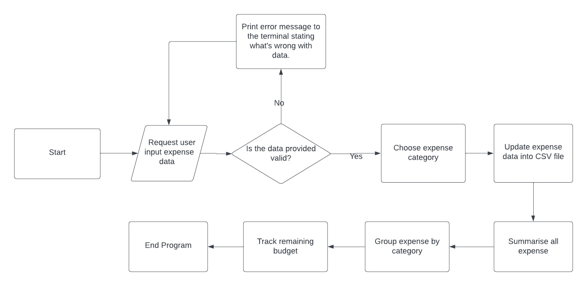
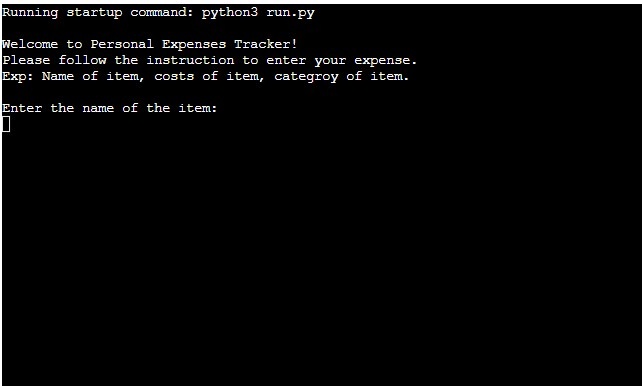
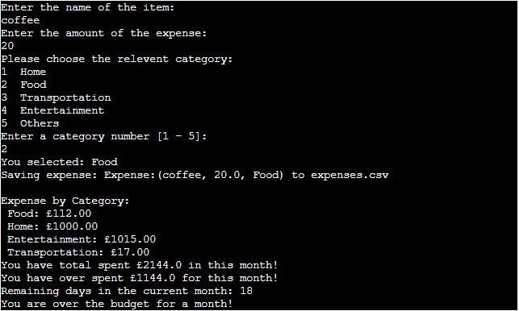
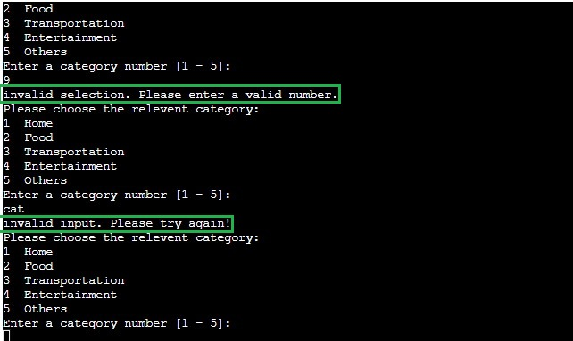
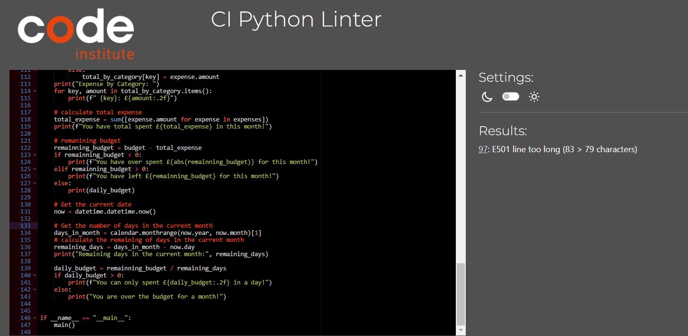
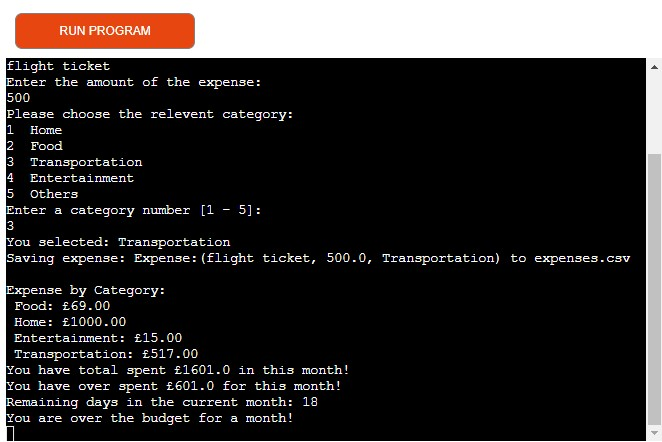
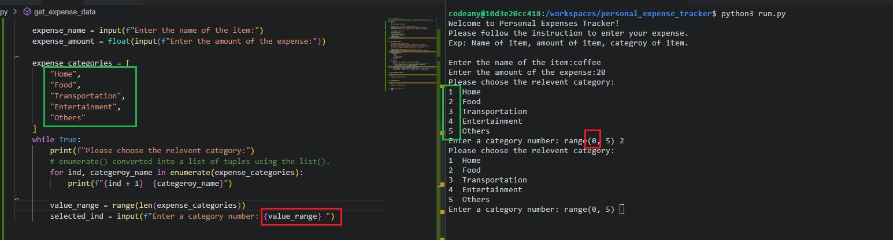
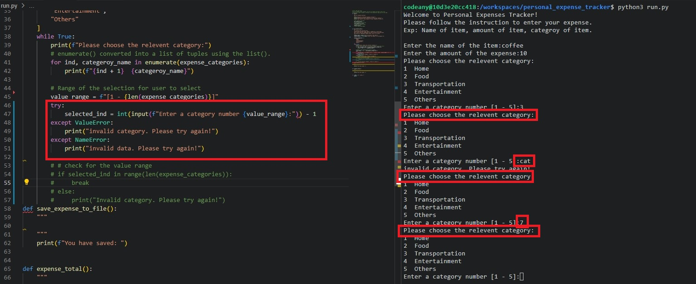
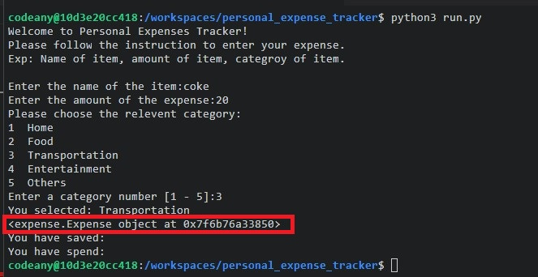
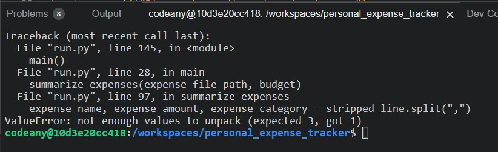

# Personal Expenses Tracker

## Overview

[Open Personal Expenses Tracker Program](https://iris-expense-tracker-2543ace1d062.herokuapp.com/)

## Personal Expenses Tracker

To make it easier to track daily expenses and understand your cash flow, this program shows how much money you've spent in each category and how much is left in your budget.

[Back to top](#personal-expenses-tracker)

## UX

### Ideal User Demographic

The ideal user for this program is:

- Anyone who wants to save money
- Track their cash flow
- Keep an eye on their expenses

### User-Stories

### Goals

- Take charge of your finances and keep track of your expenses
- allows you to categorize your expenses and easily identify where your money is going
- Give daily spending limit feature, you can ensure that you're staying on budget and making the most of your money.

### Development-Plan

# Feature

### How to use

- Follow the instructions and input the name that you spent on.
- Give it a cost of the item that you spent with.
- Select the relevant category for the item that you spent.

## Existing Features

- key in the name of the item that you spend.
- key in the cost of the item.
- choose the most relevant category.

- The tracker will input your expenses into the file
- Show the total amount of each category
- Calculate the total amount that you spent in a month
- Calculate if you have overspent how much amount and the remaining days in a month
- If you overspend will tell the user how much the user overspent

- input validation and error-checking for selecting category is out of range or key in invalid data

[Back to top](#personal-expenses-tracker)

## Future Features

- **Remove of the expense from list**
- **Add emoji to make it more fun**
- **User can input monthly budget**

[Back to top](#personal-expenses-tracker)

# Data Model

The primary function used on the application are :

- `def main()`
  - To run all program functions
- `get_expense_data()`
  - Get expense data from the user.
    Create three variable name, amount, categories to store data.
    Run a while loop for categories for user to select the valid data.
    The loop will repeatedly request data, until it is valid.
- `save_expense_to_file()`
  - Store input expense data into expense csv file.
- `summarise_expense()`
  - Summarize the total expense by read each line category
    create if else statement for stating overbudget or how much you can spent on each day.
- `class Expense`
  - The classes for the expenses to store our information

[Back to top](#personal-expenses-tracker)

# Testing

I have manually tested this project by doing the following:

- Passed the code through a PEP8 inter and confirmed there are no problems, only in line 83 is too long

- Given invalid inputs: strings when selecting categories, or number is not in the range.

- Tested in my local terminal and the Code institue Heroku terminal

[Back to top](#personal-expenses-tracker)

# Bugs

## Solved Bugs

- The range of selecting category is from (0,5) because in pythin the first number is from 0, I forgot to put the _value_range_ is from 1. I fixed by add 1 to the _value_range_ so when user select the range will only whitin 1-5.

- I encountered an issue where the try and except statements are not showing when a string or number is out of range. Because I didn't add if statement. I fixed by adding If statemnet and able to solve the problem.

- I encountered an issue where I wanted to try to print my expense, there is a series of number codes printed in the terminal. I finxed this by using _** repr **_ in the expense.py file and able to solve the issue.

## Remaining Bugs

- I have unsolve bug after amend my code.

## Validator Testing

- PEP8

  - No errors were returned from [pep8ci.herokuapp](https://pep8ci.herokuapp.com/)

  

[Back to top](#personal-expenses-tracker)

# Deployment

This project was deployed using Code Institute's mock terminal for Heroku.

- Steps for deployment:
  - After setting up you account in [Heroku](https://heroku.com/)
  - Select _New_ in the personal page and _Create new app_ from drop dwon menu.
  - Your App name must be unique, and then choose a region depend on your locations, and click _Create App_.
  - Selecting _setting_ tab, and find _Config Vars_, and set the value of KEY to _PORT_, and the value to _8000_ then select add.
  - Then go down to the Buildpacks, select _Add buildpack_, select _Python_ and save changes, and Add one more buildpack select Node.js and save changes. The order of the buildpacks is important, **python** first then **Node.js** second.

Heroku needs two additional files in order to deploy properly.

- requirements.txt
- Procfile

You can install this project's **requirements** (where applicable) using:

- pip3 install -r requirements.txt

If you have your own packages that have been installed, then the requirements file needs updated using:

- pip3 freeze --local > requirements.txt

The **Procfile** can be created with the following command:

- echo web: node index.js > Procfile

For Heroku deployment, follow these steps to connect your own GitHub repository to the newly created app:

- Select **Automatic Deployment** from the Heroku app.

The frontend terminal should now be connected and deployed to Heroku!

### Deploying on GitHub Pages

To deploy this page to GitHub Pages from its GitHub repository, the following steps were taken:

1. Log into [GitHub](https://github.com/login "Link to GitHub login page") or [create an account](https://github.com/join "Link to GitHub create account page").
2. Locate the [GitHub Repository](https://github.com/Hsiaohan-89/Iris-Chen-portfolio "Link to GitHub Repo").
3. At the top of the repository, select Settings from the menu items.
4. Scroll down the Settings page to the "Pages" section.
5. Under "Source" click the drop-down menu labelled "None" and select "Main".
6. Upon selection, the page will automatically refresh meaning that the website is now deployed.
7. Scroll back down to the "Pages" section to retrieve the deployed link.

[Back to top](#personal-expenses-tracker)

# Credits

- Code Institute for the deployment terminal

### Content

- Some of the frame design ideas were borrowed and adapted from various sites below:
  - [W3School](https://www.w3schools.com/)
  - [Chat GPT](https://chat.openai.com/)
  - [Shaun Halverson YouTube Channel](https://www.youtube.com/@ShaunHalverson)
  - [Pixegami YouTube Channel](https://www.youtube.com/@pixegami)
  - [geeksforgeeks](https://www.geeksforgeeks.org/)
  - [w3schools](https://www.w3schools.com/)

[Back to top](#personal-expenses-tracker)

## Acknowledgements

- I would like to tkank my friend who gave me some of the advice for my personal expense tracker project.
- Also like to thank all of the friends in slack who helped me solve my error for my project.
